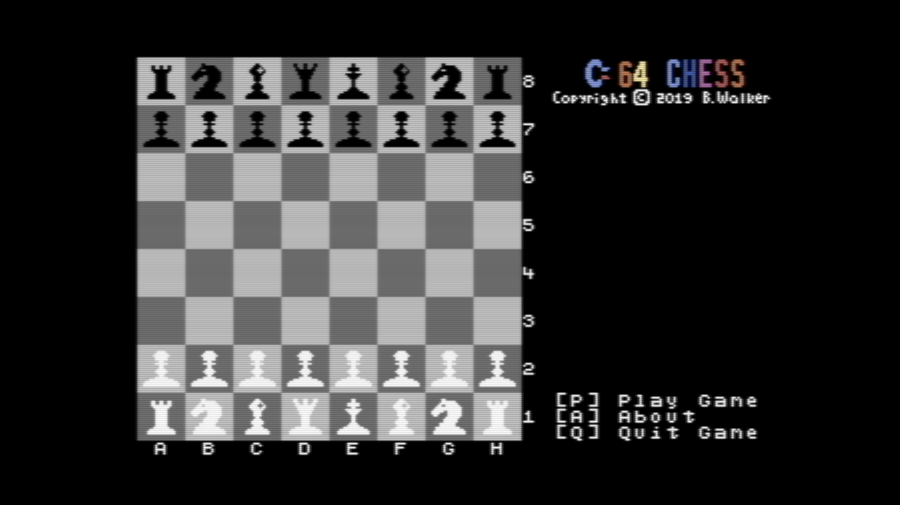

         _____                              _                    __ _  _      _____ _
        / ____|                            | |                  / /| || |    / ____| |
       | |     ___  _ __ ___  _ __ ___   __| | ___  _ __ ___   / /_| || |_  | |    | |__   ___  ___ ___
       | |    / _ \| '_ ` _ \| '_ ` _ \ / _` |/ _ \| '__/ _ \ | '_ \__   _| | |    | '_ \ / _ \/ __/ __|
       | |___| (_) | | | | | | | | | | | (_| | (_) | | |  __/ | (_) | | |   | |____| | | |  __/\__ \__ \
        \_____\___/|_| |_| |_|_| |_| |_|\__,_|\___/|_|  \___|  \___/  |_|    \_____|_| |_|\___||___/___/


#### Introduction

This is my stab at an implementation of Chess for the Commodore 64 written in 6510 assembly language.

#### LOL! Why?!

I grew up using Commodore computers, starting with the VIC-20 and progressing through the 64, the 128 and finally an Amiga 500. I learned to program on them, first in BASIC and then a bit with 6510 assembly. These machines hold a special place in my heart.

There's also a beauty in the simplicity of this machine that makes it fun and challenging to write for. When you have a machine with 65535 bytes of memory, you have to make them all count. It's not like the slop that gets thrown out on modern machines where you can drag in gigabytes of libraries without worry. On an 8 bit machine, you have to be very creative in how you allocate your memory.

Modern tool chains have also gotten to a point where it's much nicer to develop for these older machines. Back when these machines were popular, writing code for them was painful. There were no IDEs, and debugging was tricky. Now, you can edit your code in whatever editor you'd like, and there are tons of cross assemblers and cross compilers which can build your code and launch a C64 emulator like VICE for you. The edit, build, debug cycle is very short and it's easy to see the results of changes.

#### Why chess?

The gameplay of chess lines up nicely with some of the limitations of the Commodore 64. It features an 8x8 board with mostly static pieces and doesn't require sound.

One of the biggest limitations of the 64 is that it only has 8 hardware sprites. For a lot of games, this is enough, but for a chess game this poses a problem. Each side starts with 16 pieces, and so at the start of the game there are 32 pieces on the board - well beyond the 8 sprites the machine has.

To get around this, a technique called "sprite multiplexing" is used whereby the 8 sprites can be reused by changing them during a raster interrupt. In this case, each row on the chess board can contain up to 8 sprites and during the raster interrupt for each row, the sprites are moved and changed to represent the pieces on that row. It's pretty complex and challenging and requires precise timing to make it appear as though there are 32 sprites on the screen at once.

#### How do I build it?

It's all built with KickAssembler, which really is a Kick Ass Assembler! It makes it very easy to build 6502/6510 code and has a nice java-like language built in.

There's a docker image containing KickAssembler that you can use. You will need to have `Make` and `docker` installed to run this.

```bash
make build
```

This will output a file called `C64Chess.d64` that you can load into VICE or your 1541 Ultimate II+.

If you're on a Mac and you have VICE installed in `/Applications/VICE/x64sc.app/` you can run

```bash
make run
```

Which will build the code and run it in VICE.

#### How is the code laid out?

I've tried to put related things into the same files, but for the most part everything is brought in from `main.asm`. If you're going to make changes, be very careful that things don't overlap! The sprites, custom characters and music cannot move, so you'll need to make sure that everything is located around them.

The chess pieces are rendered with sprites, which have to be multiplexed to get 32 pieces. This is very easy on a game like chess where the pieces are stationary. It's also nice that the chess board is 8x8 which lines up very nicely with limitations on an 8-bit machine like the 64.

Raster interrupts are heavily used to do the sprite multiplexing. Every 24 scan lines the sprites are re-drawn to show the pieces for that row. The last row also triggers the once-per-frame subroutines (keyboard scan, title colors, music, play clock updates).

#### Important memory locations

The files `storage.asm` and `board.asm` contain variable storage and important data structures. Here are some of the more important ones:

- BoardState: This is a 64 byte block that contains the piece and color information for every location on the board. When the game starts, the upper left corner of the board is offset 0 and the lower right is offset 63. The lower 7 bits of each byte contains the sprite pointer to the piece data, and the upper bit is the color information (1 = white, 0 = black). This makes it easy to compute which sprite should be displayed during every raster routine.

- BoardSprites, BoardColors: These are each 64 byte blocks of memory that split out the sprite pointers and color information for each piece on the board.

- Board: 1000 bytes of color information for the screen, including the board.

- moveto, movefrom: These contain the selected coordinates for the movefrom and moveto locations. Each is a 16 bit word containing the column in the first byte and the row in the second byte. These values are used to compute movetoindex and movefromindex.

- movetoindex, movefromindex: These are the computed offsets in BoardState based on the values in moveto and movefrom. These values have a range of 0-63 and are used to select the piece to move as well as its destination.

- counter: The board row that's currently being drawn (0-7). This is used to select values from BoardSprites and BoardColors for the current row so that sprites can be multiplexed and drawn. It's also used to figure out when we've drawn the last row so that we can trigger the calling of our interrupt subroutines.

- fliptmp: When the board is reeversed to show the current player's view, this 64 byte location is used as a holding area as the memory is reversed.

- irqypos: A lookup table of raster lines where we'd like to trigger raster interrupts. These are triggered 4 lines before where we'd like the sprites to appear to give us time to render them.

- spriteypos: A lookup table of raster lines where we'd like our sprites to appear. These line up nicely with the board.

- spinnerenabled: When the computer is taking its turn, this is enabled to display the "Thinking" indeterminate spinner.

- spinnercurrent: Points to a location in `spinnerstart` to indicate which portion of the spinner is currently being displayed.

- subseconds: A countdown timer that starts at 60 and gets decremented every frame. When it reaches 0, the seconds for the current player is incremented.

- timers: This contains 6 bytes (hours, minutes, seconds) for each player. This is the play clock information for each player and increments when the player is currently playing.

- whitecaptured, blackcaptured: Each is a 5 byte block containing counts of each type of captured piece (pawn, knight, rook, bishop, queen) for each player.

- screenbuffer, colorbuffer: A temporary area to hold data when the "About" menu is displayed.

- showcursor: Whether to display the cursor to allow input.

- cursorxpos: Input consists of a 2 digit coordinate for movefrom and moveto (row and column), so this location will either be 0 or 1 to show which field is currently being set.

- inputselection: If movefrom is being entered, this will be $00. If moveto is being entered, it will be $80

- rowlookup: The rows that the player enters starts from 1 at the bottom of the board and increses to 8 at the top. The BoardState memory starts from the top and goes to the bottom. This introduces a bit of a disconnect, so this lookup table allows us to invert the table so that we can more easily compute movefrom and moveto offsets within BoardState.

- selectedpiece: When the player has chosen the piece to move, we stash the data from BoardState for that piece here. That way we can flash it between EMPTY_SPR and the actual piece until they've chosen the moveto coordinate.

#### Current status

It's still early days, so the game isn't even close to playable yet. My first goal is to get gameplay working to where players can take turns moving their pieces to any location and upping the captured count when pieces are captured. Once that's working reliably, I'll add in the logic to validate whether a move is legal before making it.

Lastly I'm going to add in some "AI" to allow humans to play the computer.

A stretch goal is to include pre-defined scenarios where play starts deep into a game and it's up to the player to win in X number of moves. This may prove difficult on a machine with 64k.
