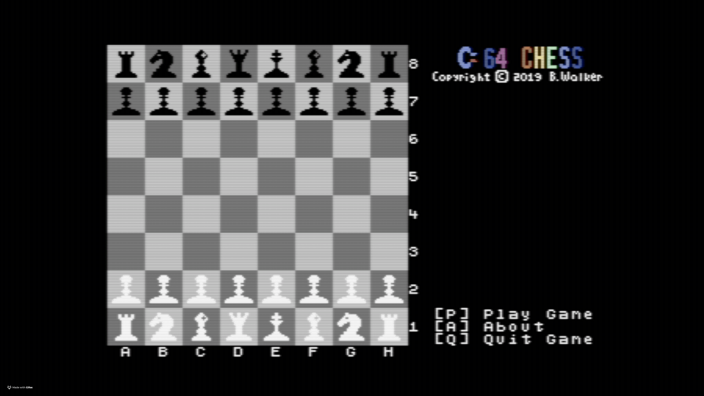

```
     _____                              _                    __ _  _      _____ _
    / ____|                            | |                  / /| || |    / ____| |
   | |     ___  _ __ ___  _ __ ___   __| | ___  _ __ ___   / /_| || |_  | |    | |__   ___  ___ ___
   | |    / _ \| '_ ` _ \| '_ ` _ \ / _` |/ _ \| '__/ _ \ | '_ \__   _| | |    | '_ \ / _ \/ __/ __|
   | |___| (_) | | | | | | | | | | | (_| | (_) | | |  __/ | (_) | | |   | |____| | | |  __/\__ \__ \
    \_____\___/|_| |_| |_|_| |_| |_|\__,_|\___/|_|  \___|  \___/  |_|    \_____|_| |_|\___||___/___/
```

> *Because apparently I hate myself and have too much free time.*

## What Is This?

A chess game for the Commodore 64, written in 6510 assembly language. Yes, really. In 2026. For a computer from 1982. I'm fine. Everything is fine.

## Why Would Anyone Do This?

**Nostalgia is a hell of a drug.** I grew up on Commodore machines - VIC-20, C64, C128, Amiga 500. Learned BASIC, dabbled in assembly, and apparently never fully recovered.

**The constraint is the point.** Modern development is drowning in dependencies. `npm install` downloads half the internet. Meanwhile, the C64 has 64KB of RAM and makes you fight for every byte. There's something beautifully brutal about that.

**The tooling got good.** Back in the day, writing C64 code meant no IDE, primitive debugging, and a lot of crying. Now we have KickAssembler, VICE emulator, and the edit-build-run cycle takes seconds. It's almost *too* easy. (It's not. I'm lying. Send help.)

## Why Chess?

Chess is perfect for the C64's limitations:
- **8x8 board** - fits the 8-bit aesthetic perfectly
- **Turn-based** - no need for 60fps buttery smoothness
- **No sound required** - good, because SID programming is its own circle of hell
- **32 pieces** - wait, that's a problem...

### The Sprite Problem

The C64 has **8 hardware sprites**. Chess needs **32 pieces**. Math doesn't math.

**Solution: Sprite Multiplexing** - a fancy term for "lying to the screen really fast." During raster interrupts, we reuse the same 8 sprites across different rows. The electron beam draws top-to-bottom, so by the time it reaches row 2, we've already repositioned the sprites. It's like a magic trick, except the magician is having a panic attack about cycle timing.

## Quick Start

### Prerequisites
- Docker
- Make
- A tolerance for retro computing

### Build

```bash
make build
```

Outputs `C64Chess.d64` - a disk image you can load into VICE or a real C64 with a 1541 Ultimate II+.

### Run (macOS with VICE)

```bash
make run
```

Builds and launches in VICE. Requires VICE installed at `/Applications/VICE/x64sc.app/`.

## Project Structure

| File | What It Does |
|------|--------------|
| `main.asm` | Entry point - pulls everything together |
| `game.asm` | Game flow, keyboard dispatch, player management |
| `input.asm` | Coordinate input handling (A1-H8) |
| `display.asm` | Screen updates, prompts, status display |
| `menus.asm` | Menu system (main, player select, etc.) |
| `moves.asm` | Move validation and piece movement |
| `board.asm` | Board state and checkerboard pattern generation |
| `raster.asm` | Sprite multiplexing via raster interrupts |
| `sprites.asm` | Sprite rendering during interrupts |
| `clock.asm` | Play clock (BCD arithmetic - *shudder*) |
| `routines.asm` | Utility routines |
| `memory.asm` | Memory operations (copy, fill, board flip) |
| `keyboard.asm` | Keyboard scanning routine |
| `constants.asm` | Constants, memory layout, zero page allocations |
| `storage.asm` | Variable storage |
| `macros.asm` | KickAssembler macros |
| `pseudocommands.asm` | Custom pseudo-instructions (`jne`, `stb`, etc.) |
| `strings.asm` | Text strings |
| `characters.asm` | Custom character set |
| `layout.asm` | Screen position calculations |
| `opening_moves.asm` | Opening book (eventually) |
| `vic.asm` | VIC-II register definitions |

## Key Data Structures

### BoardState (64 bytes)
The heart of the game. Each byte represents one square:
- **Bits 0-6**: Sprite pointer (which piece)
- **Bit 7**: Color (0=black, 1=white)

Position 0 = top-left (A8), position 63 = bottom-right (H1).

### Zero Page ($02-$25)
Precious zero page real estate, carefully allocated:
- `$02-$0c`: Memory copy/fill pointers
- `$0d-$12`: Math operations
- `$13-$1a`: Display pointers
- `$1b-$1e`: Temp storage
- `$1f-$25`: String printing

The keyboard routine also squats on `$50-$5f`. Don't touch those.

### Sprite Multiplexing Tables
- `irqypos`: Raster lines to trigger interrupts (4 lines before sprite Y)
- `spriteypos`: Where sprites actually appear

## Custom Pseudo-Commands

KickAssembler lets you create custom instructions. These appear throughout the code:

| Command | What It Does |
|---------|--------------|
| `stb value:address` | Store byte (like `lda`/`sta` combined) |
| `jne address:value:location` | Jump if not equal |
| `jeq address:value:location` | Jump if equal |
| `bfs flag:location` | Branch if flag set (bit 7) |
| `bfc flag:location` | Branch if flag clear |
| `sef flag` | Set flag (bit 7) |
| `clf flag` | Clear flag |
| `mult8` | Multiply accumulator by 8 |

## Current Status

**It's playable!** You can:
- Select pieces (they flash to confirm)
- Enter moves via coordinates (e.g., E2 to E4)
- Move pieces around the board
- Track captured pieces
- See play time for each player

**Not yet implemented:**
- Move validation (currently you can make illegal moves - honor system!)
- Check/checkmate detection
- AI opponent
- Castling, en passant, pawn promotion
- Opening book
- Endgame scenarios

## Known Issues

- The computer "thinks" but doesn't actually do anything yet. It's just vibes.
- You can absolutely cheat. The game trusts you. Don't betray that trust.

## Technical Highlights

- **~1000 bytes saved** through recent refactoring (generated checkerboard pattern, in-place board flip, consolidated routines)
- **Cycle-accurate sprite multiplexing** - 8 rows of sprites, 32 pieces total
- **BCD arithmetic** for the play clock (because regular math wasn't painful enough)
- **RTS jump tables** for keyboard dispatch (6502 doesn't have indirect indexed jumps, so we improvise)

## Building Your Own C64 Software

Want to join this particular circle of masochism? Here's what I use:

- **[KickAssembler](http://theweb.dk/KickAssembler/)** - Genuinely excellent 6502/6510 assembler
- **[VICE](https://vice-emu.sourceforge.io/)** - The gold standard C64 emulator
- **[Spritemate](https://www.spritemate.com/)** - Browser-based sprite editor
- **[CharPad](https://subchristsoftware.itch.io/charpad-free-edition)** - Character set editor

## Contributing

Found a bug? Want to add something? PRs welcome. Just remember: every byte counts, and I will judge your register usage.

## License

Do whatever you want with this. It's a chess game for a 44-year-old computer. I'm not precious about it.

---

*"640K ought to be enough for anybody."* - Not Bill Gates, but whoever said it clearly never tried sprite multiplexing.
